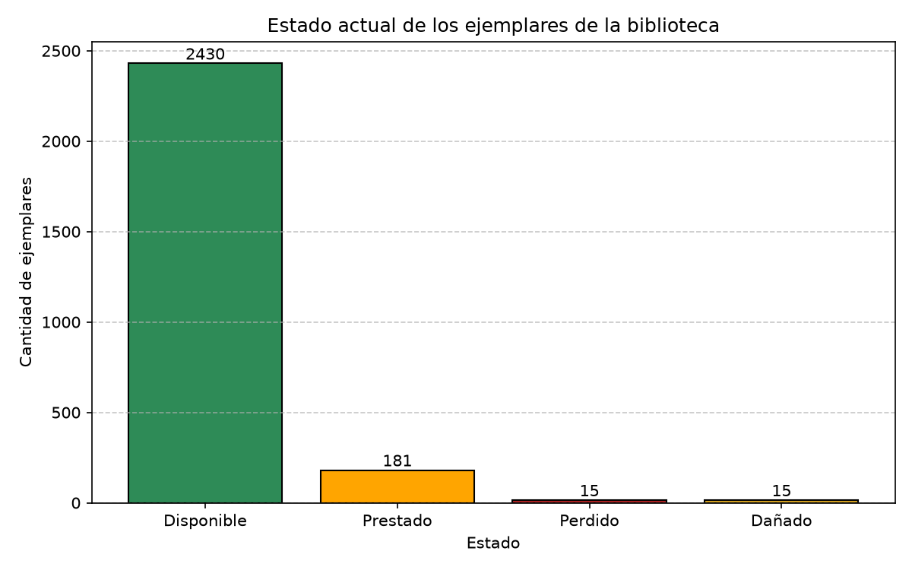
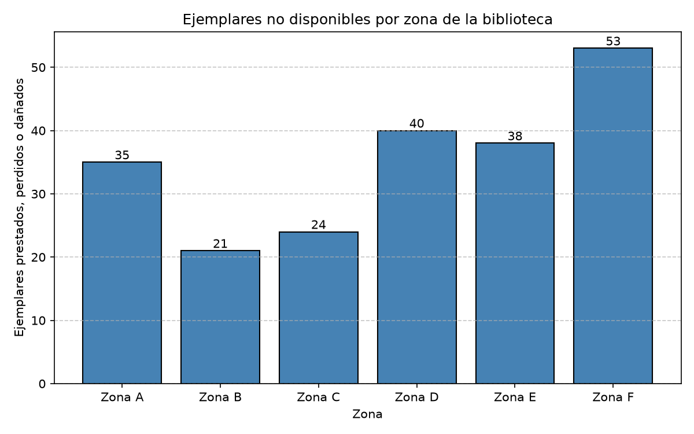
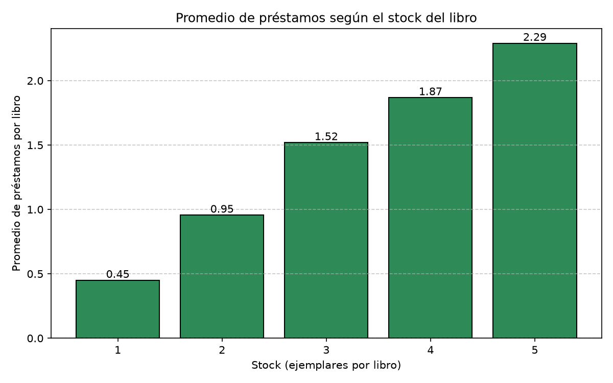

# Chatbot de IA para la gestión de inventario de la biblioteca de Cotecnova

## 1. Definición del proyecto

### 1.1 Planteamiento del problema

La biblioteca de Cotecnova, en Cartago (Valle del Cauca), cuenta con una mala gestión de su inventario, lo que lleva a que no se sepa con certeza qué ejemplares están disponibles, en qué zona se encuentran ni cuáles se están perdiendo o quedando sin devolver. Esto afecta a los dos lados:

- **Los usuarios** (estudiantes, docentes y externos) no pueden saber por su cuenta si un libro está disponible, dónde está ni qué libros hay para su carrera, y terminan dependiendo de preguntarle al bibliotecario.
- **El bibliotecario** no tiene datos para administrar la ejemplares: no sabe cuáles son los libros más solicitados, cuáles se quedaron sin copias, cuáles nunca se prestan ni qué ejemplares llevan mucho tiempo sin devolverse. Por eso decide qué comprar sin ningún respaldo.

El problema de fondo es que la base de datos no guarda la disponibilidad de los ejemplares. Solo registra los préstamos, y el estado de cada copia hay que deducirlo del historial. Por eso se necesita una herramienta que consulte ese historial y responda estas preguntas de forma inmediata: un chatbot de IA.

### 1.2 Objetivos

**Objetivo general.** Desarrollar un chatbot de inteligencia artificial que permita consultar el inventario de la biblioteca. El bibliotecario podrá obtener información para administrar la ejemplares, y los demás usuarios podrán consultar si un libro está disponible y qué libros se relacionan con su carrera.

**Objetivos específicos de este avance.**

- Cargar las tablas de la biblioteca en Python y estructurarlas como listas de diccionarios.
- Determinar el estado y la ubicación de cada uno de los 2 641 ejemplares a partir de su historial de préstamos.
- Analizar con NumPy y Matplotlib la relación entre el stock de cada libro y el número de préstamos.
- Identificar hallazgos que sirvan de base para las respuestas del chatbot y para decisiones de adquisición.

El chatbot funcionará como sistema de consulta y de recomendación. Su construcción corresponde a los siguientes cortes.

### 1.3 Datos

El proyecto de grado se desarrolla desde tercer semestre, por lo que el grupo ya contaba con el modelo entidad-relación de la biblioteca. Como no se tiene acceso a la información real de la biblioteca de la universidad, los archivos CSV fueron elaborados por el grupo a partir de ese modelo, con datos similares a los que la biblioteca maneja normalmente. Por lo tanto, **los datos son simulados y no corresponden a registros reales**. Los resultados sirven para validar el método y las funciones, y no permiten sacar conclusiones sobre la biblioteca de Cotecnova.

Se utilizan 11 archivos CSV ubicados en la carpeta `data/`:

| Tabla | Filas | Columnas | Contenido |
|---|---:|---:|---|
| `libro` | 1 200 | 7 | Título, ISBN, editorial y stock |
| `ejemplar` | 2 641 | 18 | Copias físicas: libro, ubicación, valor, código de barras |
| `ubicacion` | 60 | 2 | Zona, estante y nivel (6 zonas de 10 ubicaciones) |
| `prestamo` | 900 | 7 | Usuario, fecha de préstamo, fecha límite, fecha de devolución y multa |
| `prestamo_ejemplar` | 1 258 | 3 | Ejemplares de cada préstamo y su estado (`Devuelto`, `Prestado`, `Perdido`, `Danado`) |
| `usuario` | 400 | 12 | Usuarios y su rol (Estudiante, Docente, Bibliotecario, Externo, Administrativo) |
| `genero` | 30 | 2 | Géneros y áreas académicas |
| `libro_genero` | 1 257 | 2 | Relación entre libros y géneros |
| `autor` | 350 | 7 | Autores |
| `autor_libro` | 1 644 | 2 | Relación entre autores y libros |
| `editorial` | 40 | 2 | Editoriales |

Los préstamos abarcan del 2 de enero de 2022 al 28 de diciembre de 2025.

## 2. Estructura de datos

Los archivos se leen con el módulo `csv` de Python, sin pandas. Cada tabla se representa como una lista de diccionarios, con un diccionario por fila, y la función `cargar_todo()` reúne todas las tablas en un diccionario general. Por ejemplo, `datos["libro"][0]["titulo"]` devuelve el título del primer libro.

Todos los valores se leen como texto. Los identificadores se manejan como cadenas, y el stock y la multa se convierten a número cuando se requiere. Las fechas están en formato `AAAA-MM-DD`, por lo que al compararlas como texto se obtiene el orden cronológico.

### Funciones del proyecto

El código está en `src/`, en cuatro archivos. `cargar_datos.py` lee los CSV, `analisis_chatbot.py` calcula la disponibilidad de los libros, `eda_proyecto.py` hace el análisis exploratorio y `main.py` ejecuta el primer análisis. El análisis exploratorio se ejecuta por separado.

#### `cargar_datos.py`: lee los archivos

| Función | Qué hace |
|---|---|
| `leer_datos(nombre_archivo)` | Lee un archivo CSV y devuelve sus filas como una lista de diccionarios. Si el archivo no existe, muestra un aviso y el programa sigue funcionando. |
| `cargar_todo()` | Lee los 11 archivos con `leer_datos` y los junta en un solo diccionario. Por ejemplo, `datos["libro"]` es la tabla de libros. |
| `mostrar_resumen(datos)` | Muestra cuántos registros y qué columnas tiene cada tabla. |

#### `analisis_chatbot.py`: disponibilidad y ubicación

La base de datos no dice si un ejemplar está disponible. Para saberlo, este archivo revisa el último préstamo de cada ejemplar.

| Función | Qué hace |
|---|---|
| `estado_actual_ejemplares` | Busca el último préstamo de cada ejemplar y devuelve su estado (`Devuelto`, `Prestado`, `Perdido` o `Danado`). |
| `estado_de_cada_ejemplar` | Asigna un estado a los 2 641 ejemplares. Si nunca se prestó o ya se devolvió, queda como `Disponible`. |
| `contar_estados` | Cuenta cuántos ejemplares hay en cada estado. |
| `libros_sin_disponibilidad` | Devuelve la lista de libros que no tienen ninguna copia disponible. |
| `no_disponibles_por_zona` | Cuenta cuántos ejemplares no disponibles hay en cada zona de la biblioteca. |
| `top_libros_prestados` | Devuelve los libros más prestados (por defecto, los 10 primeros). |
| `grafico_estados`, `grafico_zonas`, `grafico_top_libros` | Dibujan gráficos de barras y los guardan en `outputs/`. |
| `main` | Ejecuta las funciones anteriores e imprime el informe. |

**Cómo funciona `estado_actual_ejemplares`.** Es la función más importante del proyecto.

1. Recorre los préstamos de cada ejemplar.
2. Se queda con el más reciente. Si dos préstamos tienen la misma fecha, gana el que tiene el id mayor.
3. El estado de ese préstamo es el estado actual del ejemplar.

Por ejemplo, si un ejemplar se prestó en enero y se devolvió, y en marzo se prestó otra vez sin devolverse, su estado actual es `Prestado`. Las fechas tienen el formato `AAAA-MM-DD`, por eso se pueden comparar como texto y el orden sale correcto.

**Cómo funciona `estado_de_cada_ejemplar`.** Toma el resultado anterior y lo completa para todos los ejemplares. Los que no aparecen (nunca se han prestado) quedan como `Disponible`, igual que los `Devuelto`. Los demás estados se dejan como `Prestado`, `Perdido` y `Dañado`.

**Cómo funciona `no_disponibles_por_zona`.** La ubicación de cada ejemplar es un texto como `"Zona A - Estante 1 - Nivel 1"`. La función se queda con la primera parte (`"Zona A"`) y cuenta los ejemplares que no están disponibles en cada zona.

#### `eda_proyecto.py`: análisis exploratorio

| Función | Qué hace |
|---|---|
| `construir_stock_prestamos` | Arma una tabla con una fila por libro: su título, cuántos ejemplares tiene (stock) y cuántas veces se ha prestado. |
| `estadisticas_numpy` | Calcula el promedio, el máximo, el mínimo y la desviación estándar de una lista de números con NumPy. |
| `libros_alta_demanda_bajo_stock` | Busca los libros con 3 o más préstamos y 3 o menos ejemplares, que son los que convendría comprar más. Esos dos números se pueden cambiar. |
| `grafico_distribucion` | Dibuja cuántos libros tienen 0, 1, 2 o más préstamos. |
| `grafico_stock_vs_prestamos` | Dibuja el promedio de préstamos según el stock del libro y devuelve esos promedios. |
| `main` | Ejecuta el análisis: imprime las estadísticas y los hallazgos, genera los gráficos y muestra los 5 primeros candidatos a comprar. |

#### `main.py`

| Función | Qué hace |
|---|---|
| `main` | Carga los datos, muestra el resumen de las tablas y ejecuta el análisis de disponibilidad de `analisis_chatbot.py`. |

Este archivo no ejecuta `eda_proyecto.py`. Además, `analisis_chatbot.main()` vuelve a cargar los CSV, por lo que se leen dos veces. Con estos datos no afecta, pero es una mejora pendiente.

## 3. Análisis exploratorio con NumPy

Estadísticas calculadas sobre los 1 200 libros:

| Variable | Promedio | Máximo | Mínimo | Desviación estándar |
|---|---:|---:|---:|---:|
| Stock (ejemplares por libro) | 2,20 | 5 | 1 | 1,19 |
| Préstamos por libro | 1,05 | 7 | 0 | 1,16 |

Estado actual de los 2 641 ejemplares: 2 430 disponibles (92,0 %), 181 prestados (6,9 %), 15 perdidos (0,6 %) y 15 dañados (0,6 %).

## 4. Visualización con Matplotlib

Los gráficos se guardan como imágenes PNG en `outputs/` (los del análisis exploratorio, en `outputs/graficos/`).



*Figura 1. Estado actual de los ejemplares. La mayor parte del inventario está disponible.*



*Figura 2. Ejemplares no disponibles por zona. La Zona F registra 53 y la Zona B, 21.*



*Figura 3. Promedio de préstamos según el stock del libro: 0,45 con un ejemplar y 2,29 con cinco.*

Además se generan `top_libros_prestados.png`, con los 10 libros más prestados, y `graficos/distribucion_prestamos.png`, con la distribución de préstamos por libro.

## 5. Hallazgos

1. **Una parte del catálogo no se presta.** 479 de los 1 200 libros (39,9 %) no registran ningún préstamo, mientras que los más solicitados llegan a 6 o 7 préstamos. El libro con más préstamos es *Realidad Aumentada: teoria y practica* (7).
2. **El stock se relaciona con los préstamos.** La correlación entre ambas variables es 0,49. Esto se explica en buena parte porque un libro con más ejemplares tiene más oportunidades de ser prestado: al dividir el promedio de préstamos entre el stock, el resultado ronda 0,5 en todos los niveles, es decir, cada ejemplar se presta con una frecuencia similar sin importar cuántas copias tenga su título.
3. **42 libros no tienen ningún ejemplar disponible.** De ellos, 31 cuentan con un solo ejemplar, por lo que su falta de disponibilidad se debe más al poco stock que a una demanda alta.
4. **Los ejemplares no disponibles se distribuyen de forma desigual entre zonas.** La Zona F concentra 53 y la Zona B, 21.
5. **Hay 65 libros candidatos a adquirir más ejemplares**, al tener 3 o más préstamos y 3 o menos ejemplares (`libros_alta_demanda_bajo_stock`).

### Consideraciones

- Los datos son simulados, por lo que estos hallazgos validan el funcionamiento de las funciones y no describen la biblioteca real.
- La disponibilidad se deduce del último préstamo de cada ejemplar. En los datos, 189 préstamos (21 %) no tienen fecha de devolución y son los que dejan un ejemplar como `Prestado`. Con datos reales sería necesario verificar con la biblioteca cómo se registran las devoluciones, las pérdidas y los daños.
- El estado `Danado` aparece sin tilde en los archivos CSV y el código lo muestra como `Dañado`.
- La desviación estándar es la poblacional (`np.std` con `ddof=0`).

## 6. Relación con el chatbot

El chatbot aún no está implementado. La siguiente tabla muestra las consultas que atenderá y la función del proyecto que aporta la información:

| Usuario | Consulta | Función |
|---|---|---|
| Estudiante, docente o externo | ¿Está disponible este libro? | `estado_de_cada_ejemplar` |
| Estudiante, docente o externo | ¿Por qué no se encuentra? | `libros_sin_disponibilidad` |
| Estudiante, docente o externo | ¿Qué libros hay para mi carrera? | Pendiente (usa `libro_genero`; ver próximos pasos) |
| Bibliotecario | ¿Cuáles son los libros más prestados? | `top_libros_prestados` |
| Bibliotecario | ¿Qué zona tiene más ejemplares fuera de la estantería? | `no_disponibles_por_zona` |
| Bibliotecario | ¿Qué libros conviene adquirir? | `libros_alta_demanda_bajo_stock` |

## 7. Ejecución

Con Docker:

```bash
docker compose up -d --build
docker compose exec python python src/main.py
docker compose exec python python src/eda_proyecto.py
```

Sin Docker:

```bash
pip install -r requirements.txt
python src/main.py
python src/eda_proyecto.py
```

`main.py` muestra el resumen de las tablas y el análisis de disponibilidad. `eda_proyecto.py` se ejecuta por separado y muestra las estadísticas y los hallazgos.

### Estructura del repositorio

```
├── Dockerfile
├── docker-compose.yml
├── requirements.txt
├── data/            # 11 archivos CSV
├── notebooks/       # cuadernos Jupyter
├── outputs/         # gráficos generados
└── src/
    ├── main.py
    ├── cargar_datos.py
    ├── analisis_chatbot.py
    └── eda_proyecto.py
```

Herramientas utilizadas: Python 3.12, NumPy, Matplotlib y Docker.

## 8. Desarrollo del proyecto

1. Se configuró el entorno con la estructura propuesta por el profesor: Docker, `requirements.txt` y las carpetas `data/`, `src/`, `notebooks/` y `outputs/`.
2. Se migró el proyecto a Visual Studio Code y se desarrolló `cargar_datos.py` para leer los 11 CSV.
3. Se desarrolló `analisis_chatbot.py` con las funciones de disponibilidad y ubicación.
4. Se desarrolló `eda_proyecto.py` con el análisis exploratorio.
5. Se creó `main.py` como punto de entrada.

## 9. Próximos pasos

Para los siguientes cortes se plantea:

1. Guardar el informe en `outputs/resumen.json` para que el chatbot lo consulte sin recalcular el análisis. Tecnología: módulo `json`.
2. Convertir `buscar_libro` en una función del proyecto que entregue disponibilidad y ubicación, sin distinguir tildes ni mayúsculas. Tecnología: `unicodedata`.
3. Medir la demanda como préstamos por ejemplar, limitada a los últimos 12 meses. Tecnología: `datetime` y `pandas`.
4. Analizar los préstamos sin cerrar y las multas: lista de ejemplares pendientes hace más de un año y recordatorios de devolución. Tecnología: `datetime` y `APScheduler`.
5. Recomendar libros por género, autor o carrera con las tablas `libro_genero` y `autor_libro`. Tecnología: `scikit-learn`.
6. Elaborar un notebook en `notebooks/` para los análisis en que `pandas` resulta útil, como `groupby` y series de tiempo. Tecnología: `Jupyter`.
7. Conectar las funciones con el chatbot y validar con la biblioteca el registro de devoluciones, pérdidas y daños. Tecnología: `FastAPI` y un modelo de lenguaje con llamadas a herramientas.
