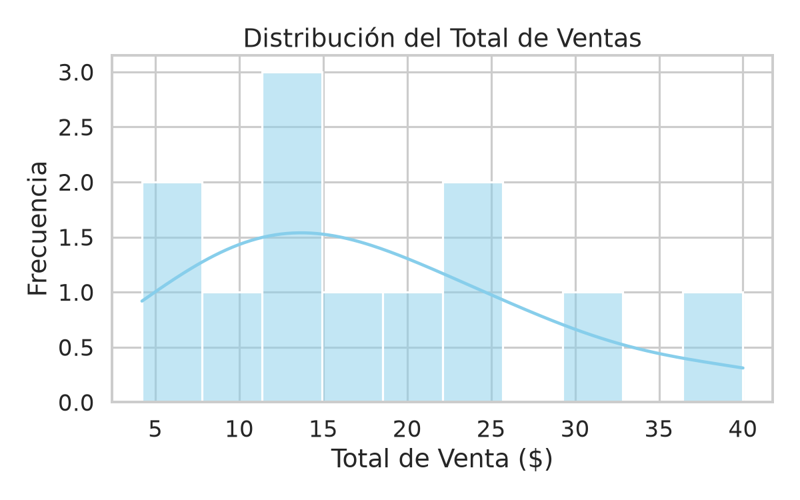
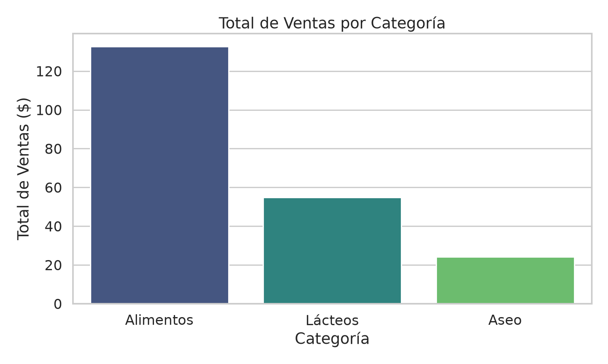
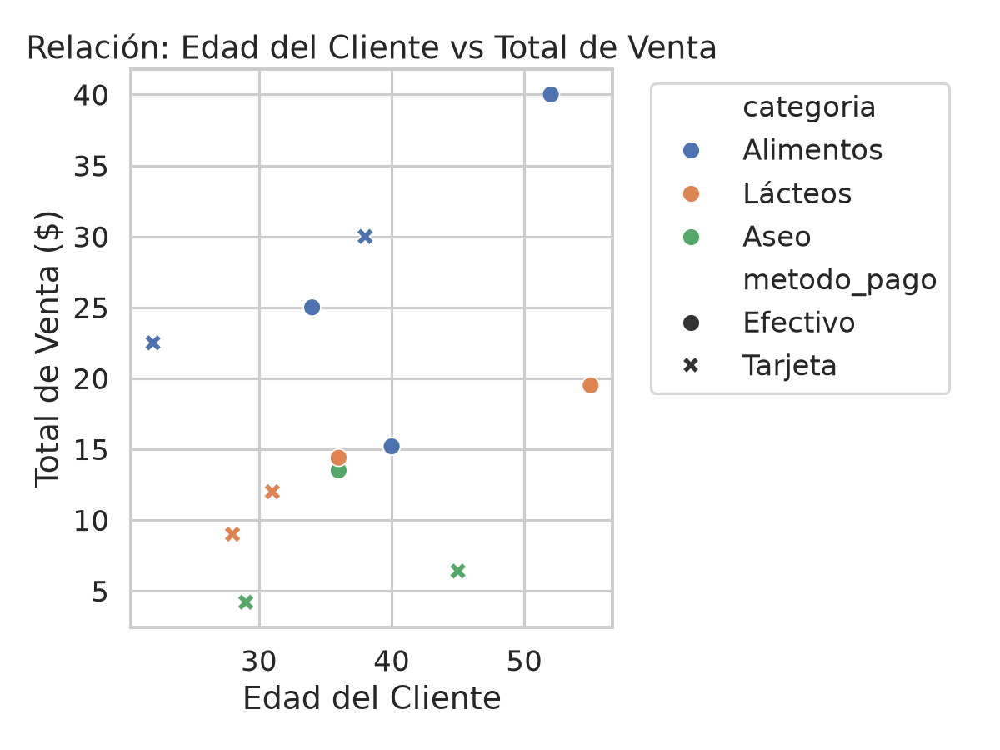

# Análisis de datos – Clase 8: Pandas, Seaborn y preparación de datos


El dataset tiene 12 ventas registradas entre el 15 y el 24 de enero de 2025. 
---

## 1. Exploración

**¿Cuántas filas y columnas tiene el dataset?** 12 filas y 9 columnas.

**¿Qué tipos de datos hay?**

| Columna | Tipo | No nulos | Qué representa |
|---|---|---|---|
| `id_venta` | int64 | 12 | Identificador de la venta |
| `fecha` | texto (`str`) | 12 | Fecha de la venta, aún sin convertir a fecha real |
| `producto` | texto | 12 | Producto vendido (10 valores distintos en 12 filas) |
| `categoria` | texto | 12 | Alimentos, Lácteos o Aseo |
| `precio_unitario` | float64 | 12 | Precio de una unidad |
| `cantidad` | int64 | 12 | Unidades vendidas |
| `ciudad` | texto | 12 | Cartago, Pereira, Manizales o Armenia |
| `cliente_edad` | float64 | **10** | Edad del cliente |
| `metodo_pago` | texto | 12 | Efectivo o Tarjeta |

`cliente_edad` aparece como decimal aunque las edades sean enteras: cuando una columna entera tiene nulos, Pandas la pasa a `float64` porque `NaN` es un valor decimal.

**¿Hay valores nulos?** Sí, 2 valores nulos, ambos en `cliente_edad` (las ventas 6 y 12), lo que equivale a 16.7 % de esa columna. Las demás columnas están completas.

**Estadísticas descriptivas relevantes** (`df.describe()` sobre los datos originales):

| | precio_unitario | cantidad | cliente_edad |
|---|---|---|---|
| count | 12 | 12 | **10** |
| media | 3.10 | 6.50 | 37.40 |
| desv. estándar | 1.55 | 4.19 | 10.73 |
| mínimo | 1.50 | 2 | 22 |
| mediana (50 %) | 2.50 | 5.50 | 36 |
| máximo | 6.50 | 15 | 55 |

`describe()` también incluye `id_venta`, pero calcular su media o su desviación no tiene sentido: es un identificador, no una medida.

---

## 2. Limpieza

**¿Cómo se manejaron los valores nulos?** Los 2 nulos de `cliente_edad` se rellenaron con la mediana de las 10 edades conocidas, que es **36.0**. Las ventas afectadas son la 6 (Detergente, $13.50) y la 12 (Leche, $14.40), dos compras de valor cercano a la mediana de ventas ($14.80).

**¿Por qué la mediana y no la media?** Con las edades ordenadas (22, 28, 29, 31, 34, 38, 40, 45, 52, 55) la mediana es 36.0 y la media es 37.4. La diferencia es pequeña porque en este caso no hay valores extremos. Se prefiere la mediana por robustez: si hubiera un error de digitación (por ejemplo, una edad de 120), la media subiría varios años y la mediana casi no se movería. Para imputar sin saber si los datos están limpios, es la opción más segura.

Dos advertencias sobre esta decisión:

- Rellenar con un valor constante deja a dos clientes con exactamente la misma edad, lo que reduce un poco la variabilidad real de la columna.
- Calcular la mediana con todo el dataset antes de dividir en entrenamiento y prueba filtra información del conjunto de prueba hacia el de entrenamiento (fuga de datos). En un modelo real la mediana debe calcularse solo con el conjunto de entrenamiento.

**Columna derivada:** `total_venta = precio_unitario × cantidad`. En esta versión se agrega además `dia_semana` (0 = lunes), obtenida al convertir `fecha` a tipo fecha.

---

## 3. Visualización



**Distribución del total de ventas.** Las ventas van de $4.20 a $40.00, con media de $17.64 y mediana de $14.80. Como la media es mayor que la mediana, la distribución tiene sesgo a la derecha: hay muchas ventas pequeñas y pocas grandes. Las tres ventas más altas ($40.00 de Café, $30.00 y $25.00 de Arroz) son todas de Alimentos.



**¿Qué categoría tiene el mayor total de ventas?** Alimentos, con $132.70 de un total de $211.70.

| Categoría | Total vendido | % del total | N.º de ventas | Venta promedio |
|---|---|---|---|---|
| **Alimentos** | $132.70 | 62.7 % | 5 | $26.54 |
| Lácteos | $54.90 | 25.9 % | 4 | $13.73 |
| Aseo | $24.10 | 11.4 % | 3 | $8.03 |

Alimentos lidera no solo por tener una venta más que Lácteos, sino porque cada venta es en promedio casi el doble de grande.



**¿Existe relación entre la edad del cliente y el total de la venta?** Existe una relación positiva, pero débil: el coeficiente de correlación es **0.37** (calculado después de imputar las edades). Con 12 puntos, y 2 de ellos con la edad imputada, no es una relación concluyente.

La matriz de correlación (`correlacion.png`, que genera la versión optimizada) ayuda a entender por qué es tan baja:

| Par de variables | Correlación |
|---|---|
| `cantidad` – `total_venta` | 0.64 |
| `cliente_edad` – `total_venta` | 0.37 |
| `precio_unitario` – `total_venta` | 0.31 |
| `cliente_edad` – `precio_unitario` | 0.87 |
| `precio_unitario` – `cantidad` | -0.42 |
| `cliente_edad` – `cantidad` | -0.36 |

Lo que más se relaciona con el total de la venta es **la cantidad de unidades**, no la edad. Los clientes de más edad de la muestra compran productos más caros (Café a $5.00 con 52 años, Queso a $6.50 con 55), pero en menos unidades. Ese efecto contrario entre precio y cantidad es lo más probable que mantenga baja la correlación entre edad y total. Un caso que ilustra que la edad no manda: el cliente más joven (22 años) gastó $22.50 en pan, más que varios clientes mayores.

**Otras observaciones del análisis:**

- **Método de pago:** Efectivo suma $127.60 con una venta promedio de $21.27; Tarjeta suma $84.10 con $14.02 (6 ventas de cada tipo).
- **Ciudad:** Cartago concentra $121.70 (57.5 % del total) y 6 de las 12 ventas, seguida de Manizales ($42.00), Armenia ($26.40) y Pereira ($21.60).

---

## 4. Preparación para Machine Learning

**¿Qué columnas se codificaron?** Dos columnas categóricas nominales, con One-Hot Encoding (`pd.get_dummies`):

- `categoria` → `cat_Alimentos`, `cat_Aseo`, `cat_Lácteos`
- `metodo_pago` → `pago_Efectivo`, `pago_Tarjeta`

Se usa One-Hot y no Label Encoding porque las categorías no tienen orden: asignarles 0, 1, 2 le sugeriría al modelo que Lácteos es "mayor" que Aseo.

El dataset final queda con 12 filas y 10 columnas, todas numéricas: `precio_unitario`, `cantidad`, `cliente_edad`, `total_venta`, `dia_semana` y las 5 columnas codificadas. (En el script original del profesor, que no crea `dia_semana`, son 9 columnas.)

**¿Por qué se eliminaron `id_venta`, `fecha`, `producto` y `ciudad`?**

| Columna | Motivo |
|---|---|
| `id_venta` | Es solo un identificador: no describe la venta y el modelo podría memorizarlo en vez de aprender patrones. |
| `fecha` | Es texto, y con 10 días de datos no hay patrón temporal que aprender. Se conserva su información útil en `dia_semana`. |
| `producto` | Tiene 10 valores distintos en 12 filas. Un One-Hot generaría casi una columna por fila (sobreajuste), y su información ya la cubren `categoria` y `precio_unitario`. |
| `ciudad` | Se elimina por simplicidad y por la poca muestra (4 ciudades en 12 filas). No es que carezca de información: con más datos convendría codificarla también. |

Dos puntos que conviene tener presentes para la siguiente clase:

- **Fuga de datos con `total_venta`:** como `total_venta = precio_unitario × cantidad`, si el objetivo del modelo fuera predecir `total_venta`, esas dos columnas tendrían que salir de las variables de entrada, porque contienen la respuesta.
- **Trampa de las variables ficticias:** `cat_Alimentos + cat_Aseo + cat_Lácteos` siempre suma 1, así que una de las tres es redundante. Para modelos lineales se usa `drop_first=True`.

---

## 5. ¿Se puede optimizar el código? Propuesta

Sí. El script del profesor funciona, pero tiene problemas de portabilidad (Docker/WSL), de repetición de código y dos pasos que la guía menciona en la teoría y no implementa. La propuesta está en `src/clase8/preparacion_datos_optimizado.py`.

### 5.1 Comparación con el script original

| Aspecto | Script del profesor | Propuesta | Beneficio |
|---|---|---|---|
| Rutas | `'ventas_tienda.csv'` relativa a donde se ejecute | `pathlib` calculado desde la ubicación del script | Funciona igual en WSL, Docker o VSCode, sin depender del directorio actual |
| Gráficos | `plt.show()` | Backend `Agg` y `plt.close()` | En Docker/WSL no hay pantalla: `show()` no muestra nada o falla |
| Guardado de figuras | `tight_layout`, `savefig` y `show` repetidos 3 veces | Función `guardar_figura()` | Menos código repetido y un solo lugar donde cambiar el formato |
| `explorar_datos` | `print(df.info())` imprime un `None` extra | `df.info()` | Salida limpia (`info()` ya imprime por sí sola) |
| Nulos | Imputación escrita solo para `cliente_edad` | `imputar_mediana()` trabaja con cualquier columna numérica con nulos; además se reporta el % de nulos | Si el CSV cambia, el código sigue funcionando |
| Validación | Ninguna | Se verifica que el CSV tenga las columnas esperadas | Falla con un mensaje claro y no con un `KeyError` en medio del proceso |
| Nombres de columnas | Texto repetido en varias funciones | Constantes al inicio del archivo | Un solo lugar para editar |
| `barplot` | `estimator=np.sum` y `palette` sin `hue` (genera advertencias) | `estimator="sum"`, `hue` con `legend=False` y valores escritos sobre cada barra | Sin advertencias, no necesita importar numpy y la gráfica se lee sin consultar el eje |
| One-Hot | Devuelve `True`/`False` | `dtype=int` (0/1) | Formato numérico estándar para modelos |
| `fecha` | Se elimina sin aprovecharla | Se convierte a fecha y se deriva `dia_semana` | Conserva información útil |
| Correlación | No se visualiza | Mapa de calor (`correlacion.png`) | Respalda con números la pregunta sobre edad vs. total |
| Escalado | **No se hace**, aunque la guía lo lista como paso 3 de la preparación | `StandardScaler` sobre las columnas continuas | Cubre el paso que faltaba |

### 5.2 Fragmentos clave

Imputación reutilizable (reemplaza el código fijo para `cliente_edad`):

```python
def imputar_mediana(df):
    """Rellena con la mediana TODAS las columnas numéricas que tengan nulos."""
    df = df.copy()
    for col in df.select_dtypes("number").columns:
        if df[col].isnull().any():
            mediana = df[col].median()
            df[col] = df[col].fillna(mediana)
    return df
```

Validación de la entrada:

```python
faltantes = set(COLUMNAS_ESPERADAS) - set(df.columns)
if faltantes:
    print(f"Error: faltan columnas en el CSV: {sorted(faltantes)}")
    return None
```

Escalado de características:

```python
escalador = StandardScaler()
df_esc[COLUMNAS_A_ESCALAR] = escalador.fit_transform(df_esc[COLUMNAS_A_ESCALAR])
```

`total_venta` se deja sin escalar porque es el candidato natural a variable objetivo, y la variable que se quiere predecir no se escala. La desviación estándar de las columnas escaladas aparece como 1.04 al calcularla con Pandas (que divide entre n−1); `StandardScaler` divide entre n, y con ese criterio vale exactamente 1.

### 5.3 Verificación

Se ejecutó la propuesta con el CSV de la guía y el archivo `ventas_preparadas_ml.csv` resultó **idéntico** al que produce el script original con los mismos pasos de limpieza. Es decir, la optimización mejora el código sin cambiar los resultados, y agrega `ventas_escaladas_ml.csv` como salida adicional.

```bash
python src/clase8/preparacion_datos_optimizado.py
```

### 5.4 Limitaciones y siguiente paso

- La mediana y el escalador se ajustan aquí con todos los datos solo para mostrar la técnica. Con el proyecto real hay que dividir primero en entrenamiento y prueba (tema de la próxima clase) y ajustarlos únicamente con el conjunto de entrenamiento.
- La evolución natural de esta propuesta es reunir imputación, One-Hot y escalado en un solo `Pipeline` de scikit-learn con `ColumnTransformer`, de modo que el mismo preprocesamiento se aplique idéntico a los datos de entrenamiento y de prueba.